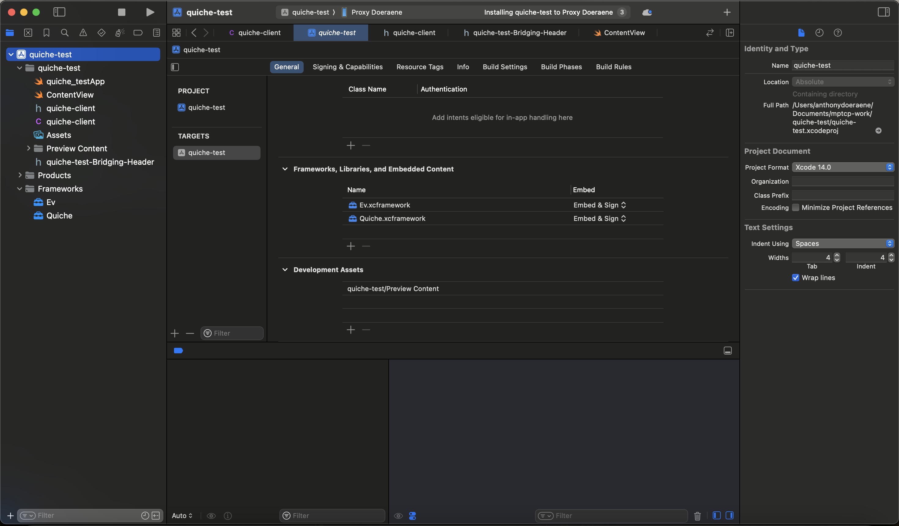

## Build the app

1) Build the dependencies by running `./build-dependencies.sh`
2) Add the `Quiche` and `Ev` frameworks that were built in [1](#1). to the dependencies
   of your project

3) Select a real device, and click the run button (note that it doesn't work on simulated devices)